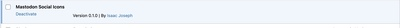

# Social Icons for Mastodon

[Deployed here on Wordpress plugins library](https://wordpress.org/plugins/social-icons-for-mastodon/).

This plugin allows replacing the top-100 (by user) Mastodon domains (as of plugin publication) with the Mastodon logo SVG [via this mechanism](https://wordpress.org/documentation/article/twenty-twenty-one/#add-social-icons):

> the text label you provide will be hidden, and an icon will be shown in its place. 

# 1. Current Limitations 
1. Currently only works with [twenty-twenty-one](https://wordpress.org/themes/twentytwentyone/) theme and later
2. Non-top-100 domains were queried at plugin publishing time (2023-02-18) from `instances.social`: `'https://instances.social/api/1.0/instances/list?count=0&include_closed=true&include_down=false&sort_by=users&sort_order=desc`

[I (or anyone else) can work to address these limitations if there is interest.](https://github.com/ijoseph/mastodon_social_icons)

# 2. Example
See [here](https://core.trac.wordpress.org/ticket/57293#comment:17) for more details of the example (although note that this describes a slightly separate process, which was patching the theme itself; this plugin achieves the same effect, except with 100 domains, rather than 10). 

## 2.1 Set up Theme: Twenty Twenty-One

## 2.2 Create a Secondary Menu

## 2.3 Add custom links

## 2.4 Before

The `mastodon.com` logo is (erroneously, as it is not a true mastodon domain) is replaced by the `svg`, but a `mastodon.social` link is _not_.
## 2.5 After

### 2.5.1 Activate Plugin

notice that `mastodon.com` (not a true mastodon domain) is not replaced, but that a `mastodon.social` link _is_ replaced. 

# 3. Support
Open an [issue on github](https://github.com/ijoseph/mastodon_social_icons/issues).

License: GPLv2
License URI: http://www.gnu.org/licenses/gpl-2.0.html
